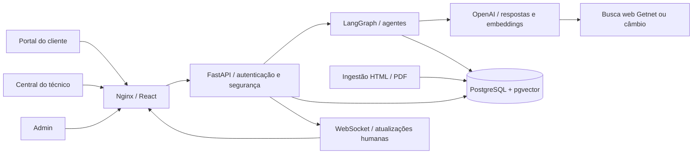
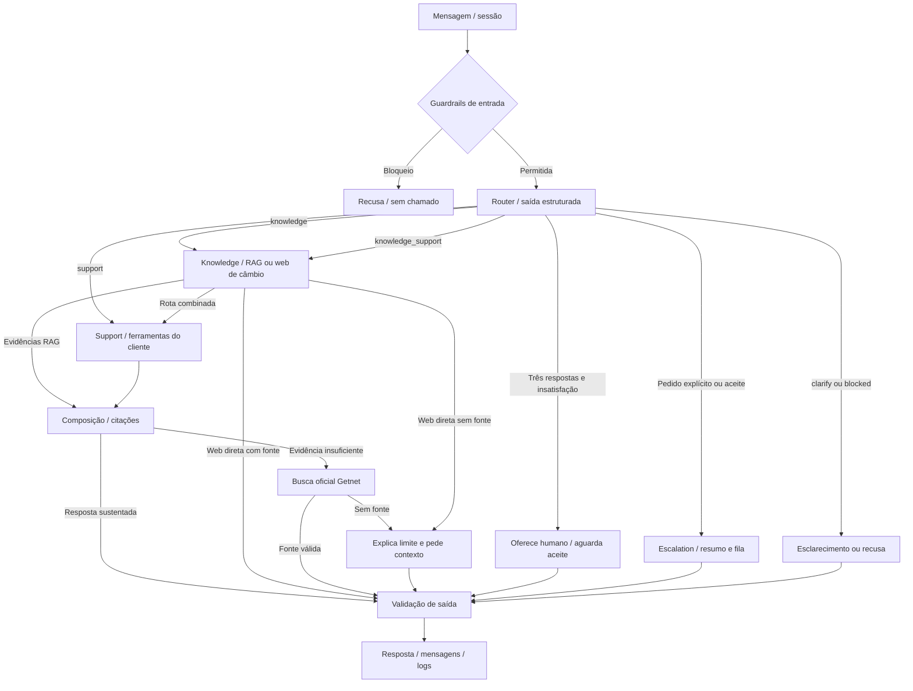
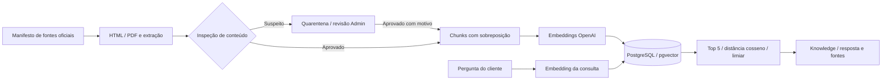

# Getnet · sistema multiagente de atendimento

Protótipo para o desafio [AI Hardcore Engineer — Multi-Agent Support System](knowledge/Desafio.md). Reúne Router, Knowledge, Support e Escalation em um fluxo LangGraph; RAG com páginas e manuais oficiais da Getnet; ferramentas de consulta a dados fictícios; busca web; portal do cliente; Central de Atendimento humana; e painel administrativo.

**Não é um canal oficial da Getnet.** Clientes, máquinas, recebíveis e chamados são fictícios. Não executa transações financeiras. Use apenas dados de demonstração.

Para uma comparação requisito a requisito, consulte [Aderência ao desafio](docs/ADERENCIA_DESAFIO.md). Para explicar o projeto e conduzir a demonstração, consulte o [Guia técnico de apresentação](docs/GUIA_TECNICO_APRESENTACAO.md). As correções recentes estão registradas nos [retestes de segurança](docs/RETESTE_SEGURANCA_IA_2026-10-04.md) e [funcional](docs/RETESTE_FUNCIONAL_2026-10-04.md).

## Rodar do zero com Docker

Requisitos: Docker Desktop (ou Docker Engine) com contêineres Linux, Docker Compose v2, portas locais `8080`, `8000` e `5433` livres e, para respostas reais da IA, uma chave OpenAI API com faturamento/crédito disponível. A assinatura do ChatGPT não fornece crédito para a API. Clone o repositório e execute os comandos abaixo **na pasta que contém `docker-compose.yml`**. No PowerShell:

```powershell
Copy-Item .env.example .env
notepad .env
```

No macOS/Linux: `cp .env.example .env` e edite `.env` no editor de sua preferência. Não copie valores de produção para o ambiente demo.

Preencha `OPENAI_API_KEY` e salve. A chave deve ser da API OpenAI; os dados seed não exigem nenhum serviço Getnet. Para apenas abrir as telas e os dados fictícios, a chave pode ficar vazia, mas o RAG ficará degradado e respostas da IA não funcionarão plenamente. **Não sobrescreva um `.env` já existente** e nunca envie esse arquivo ao Git. Para iniciar:

```powershell
docker compose up --build -d
docker compose ps
Invoke-RestMethod http://localhost:8000/api/health/ready
```

Abra [portal do cliente](http://localhost:8080) e [login interno](http://localhost:8080/login). Em desenvolvimento, a [documentação da API](http://localhost:8000/docs) está disponível. A primeira subida aplica migrations, cria dados fictícios e, com `RAG_AUTO_INGEST=true`, coleta/indexa as fontes de `data/sources.json`. Isso pode demorar e consumir créditos de embeddings. Acompanhe com `docker compose logs -f api`; interrompa os logs com Ctrl+C.

A resposta de `/api/health/ready` deve mostrar banco disponível. Com chave, fontes acessíveis e bootstrap concluído, `rag_chunks > 0` e `degraded=false`. Se `degraded=true`, a API subiu, mas o RAG não está pronto: confira a chave, os logs e a Base de conhecimento no Admin; use **Reindexar aprovados** quando a causa estiver resolvida. O repositório traz o manifesto das fontes, código de ingestão e migrations, mas **não inclui** embeddings prontos: na primeira execução com chave, eles são gerados no banco local. `db/seed/README.md` explica o snapshot opcional. O conteúdo externo pode mudar ou ficar indisponível; uma falha de coleta aparece no log e no status, sem impedir o login.

Credenciais criadas **somente em um banco de demonstração novo**:

| Área | Usuário | Senha inicial |
|---|---|---|
| Administrador | `Admin` | `Admin` |
| Técnico | `Tecnico` | `Tecnico` |
| Cliente Café Aurora | `cliente1988` | `123` |
| Cliente Mercado Horizonte | `cliente2026` | `123` |

Essas senhas são inseguras e existem apenas para a apresentação local. O seed é idempotente: em um volume já usado, senhas alteradas não são restauradas automaticamente, e alguns registros seed podem ser reativados na subida. Um login novo criado pelo Admin pode exigir troca de senha inicial. Outros técnicos/clientes podem ser cadastrados pelo Admin. Para demonstrar transferência com duas pessoas, crie um segundo técnico em **Admin → Usuários** e deixe os dois online. Clientes são administrados em **Admin → Clientes**, separados da equipe.

Para encerrar sem apagar dados: `docker compose down`. Para subir novamente: `docker compose up -d`. **`docker compose down -v` apaga o volume do banco**; use apenas se desejar perder todos os dados locais de demonstração. Depois de mudar `.env`, recrie o serviço: `docker compose up -d --force-recreate api`.

O frontend fica em `127.0.0.1:8080` e a API em `127.0.0.1:8000`. O PostgreSQL não é publicado no host pelo Compose principal; o `docker-compose.override.yml`, carregado automaticamente pelo comando padrão, o expõe apenas em `127.0.0.1:5433` para desenvolvimento. O acesso à porta do banco usa o usuário `getnet`, o banco `getnet` e a senha definida por `POSTGRES_PASSWORD` no `.env` — não compartilhe essa senha.

## Teste rápido do contrato do desafio

O endpoint exigido é `POST /api/chat` com `message` e `user_id`. O curl sem login só é aceito no modo local `CHAT_ALLOW_ANONYMOUS_DEMO=true`; **`user_id` sozinho não é autenticação**. No portal, a identidade vem da sessão e não pode ser escolhida pelo corpo da requisição.

```powershell
$body = @{ message = 'Qual a diferença entre a Get Clássica e a Get Smart?'; user_id = 'cliente1988' } | ConvertTo-Json
Invoke-RestMethod -Uri http://localhost:8000/api/chat -Method Post -ContentType 'application/json; charset=utf-8' -Body ([Text.Encoding]::UTF8.GetBytes($body))
```

A resposta JSON inclui `answer`, `route`, `agents_used`, `sources`, `conversation_id` e dados de execução. Perguntas sobre recebíveis e máquina consultam dados fictícios do próprio cliente. O escopo atual é **Getnet e cotação de câmbio**. Câmbio usa fontes financeiras oficiais (`bcb.gov.br` e `ecb.europa.eu`), com par de moedas e data; produtos e suporte usam RAG/site Getnet. Clima e outros temas alheios são recusados sem abrir chamado. Valores legados de `OFF_TOPIC_POLICY` não reabrem clima. Veja a [análise dos dez exemplos do desafio](docs/POLITICA_ATENDIMENTO.md): nove são atendidos, e a previsão do tempo foi restringida por decisão de produto.

## Como funciona

### Interfaces e identidade visual

No chat, **Base interna** identifica evidência recuperada do RAG (inclusive páginas Getnet já indexadas); **Busca online** identifica busca feita naquele atendimento. Um link para o site não significa, sozinho, consulta ao vivo.

### Demonstração sem orçamento diário

`DEMO_UNLIMITED_USAGE=true` libera os orçamentos diários locais de tokens por cliente e de chamadas de modelo/embeddings/web quando `APP_ENV=development` e `DEMO_MODE=true`. O exemplo de ambiente vem habilitado para a apresentação. O uso continua contabilizado; não apaga histórico ou contadores. Em produção ou fora do modo demo, esse sinalizador não desativa os limites. Guardrails, autenticação e limitação de mensagens por minuto continuam ativos. **A cobrança e os limites da conta OpenAI continuam valendo**; desligue o sinalizador para voltar aos tetos locais.

### RAG antes da busca online

Conhecimento Getnet sempre começa pela base interna; somente falta de evidência suficiente aciona o site oficial. Câmbio continua sendo consulta externa permitida. A recuperação combina similaridade vetorial pgvector com busca textual PostgreSQL em títulos/trechos, mantendo a exclusão de conteúdo pendente ou em quarentena. O título ajuda a recuperar cadastros curtos que uma busca exclusivamente vetorial pode perder. O modelo selecionado da máquina complementa apenas consultas de suporte técnico, não perguntas gerais sobre endereço ou Link de Pagamento.

Os portais do cliente e do técnico seguem a mesma melhoria de legibilidade do Admin: tipografia ampliada, campos e botões maiores, cartões com hierarquia clara e layouts responsivos. A revisão inclui login, troca de senha, atendimento, máquinas, conta, fila, conversas ativas, encerradas, contexto e modais de atendimento. Em telas menores, o contexto do técnico fica abaixo da conversa, em vez de desaparecer. Os fluxos e permissões permanecem os mesmos.

No cliente, o chat aproveita mais a largura disponível (até 1440 px), com mensagens de 16 px, cabeçalho e rodapé compactos e a frase de ajuda junto à identificação do assistente. A seção atual do menu fica destacada em vermelho, com sublinhado e marcação acessível de página ativa.

O logotipo original foi obtido do [site oficial da Getnet](https://site.getnet.com.br/wp-content/uploads/2022/08/LOGO-GETNET.png) e incluído localmente, sem depender de uma requisição externa para aparecer. A marca pertence à Getnet e não está coberta pela licença do código deste protótipo; seu uso não indica vínculo ou endosso oficial. Veja [Interfaces dos portais](docs/INTERFACE_PORTAIS.md) para escopo e testes.

### Dashboard administrativo

Em **Admin → Dashboard**, os indicadores têm tipografia ampliada, layout assimétrico e detalhes em modal centralizado. Clique nos cartões, barras por dia, rotas dos agentes, taxa de escalonamento ou detalhes de um técnico para consultar valores e sua base de cálculo. O modal também funciona por teclado (Enter, Tab e Escape).

O resumo começa em Hoje e permite Hoje, 7 ou 30 dias e uma **data específica** no calendário. O gráfico **Conversas dos últimos 7 dias** sempre mostra sete dias completos (inclusive zeros); **Ver conversas** abre a lista paginada, e clicar numa barra filtra aquele dia. Os detalhes de **Eventos bloqueados** mostram regras, horários, severidade e trechos de entrada mascarados; saídas bloqueadas são omitidas. **Encaminhadas a técnicos** mostra cliente, situação e responsável humano, sem confundir o agente Support com um técnico.

A leitura atualiza a cada 30 segundos e pelo botão **Atualizar**. Clientes conectados aparecem separados dos técnicos; a presença é registrada por aba autenticada no PostgreSQL, atualizada a cada 30 segundos e expira após 90 segundos sem atualização. No portal, o registro começa após validar o perfil de cliente em `/api/auth/me` e é renovado também ao voltar à aba. Fechar/sair da aba tenta liberar sua presença imediatamente; logout, troca de senha e desativação invalidam a presença da sessão. Técnico disponível exige presença recente **e** disponibilidade Online — o valor salvo sozinho não conta como conectado. Atualize também as abas já abertas após instalar esta versão.

Fila, atendimentos ativos e presença são o estado atual, independentemente da data selecionada. Conversas sem handoff **não significam resolução confirmada pela IA**. As listas de conversas exibem metadados, não o conteúdo do chat ou notas internas. Os detalhes têm calendário próprio, restrição de Admin e paginação de 10 registros.

Teste da interface: `cd frontend` e `npx playwright test tests/dashboard.spec.ts`. Referências e critérios visuais em [Dashboard administrativo](docs/DASHBOARD_ADMIN.md).



O orquestrador está em `backend/app/agents.py`; prompts separados por agente em `backend/app/prompts.py`; chamadas OpenAI em `backend/app/provider.py`. O LangGraph compartilha estado tipado entre nós por chamadas locais, sem fila externa. O Router pode escolher uma sequência Knowledge + Support para uma pergunta mista. A IA decide a rota e redige respostas; autorização, propriedade de máquinas, seleção de ferramentas e transições do handoff são regras em código.

- **Router:** classifica intenção e segurança; produz rota estruturada validada.
- **Knowledge:** recupera evidências do RAG e, se insuficientes, tenta busca oficial; não deve inventar preços, taxas ou prazos.
- **Estilo das respostas:** começa pela informação sustentada pela fonte e a cita, sem ressalvas genéricas de incerteza. Lacunas, conflitos e limitações reais continuam explícitos. Texto cadastrado manualmente não é apresentado como documento oficial. A política compartilhada está em `ANSWER_STYLE`, em `backend/app/prompts.py`, e vale para Knowledge, Support e busca web.
- **Support:** usa ferramentas de leitura `get_customer_profile`, `get_receivables`, `get_terminal_status` e `list_customer_terminals`. O backend injeta a identidade da sessão.
- **Escalation:** resume a conversa e abre handoff após pedido explícito ou aceite de uma oferta de atendimento humano. Após três respostas de assistência e insatisfação do cliente, a IA oferece o técnico. RAG/web sem resposta pede mais contexto; não cria chamado automaticamente.

### Como o LangGraph orquestra os agentes

**Câmbio com contexto:** uma pergunta genérica pede apenas o par ausente; a resposta “dólar para real hoje” completa a consulta e aciona Knowledge/web. Respostas curtas de data usam a última pergunta de câmbio do cliente na memória da conversa. A consulta USD/BRL e EUR/BRL usa primeiro a API pública PTAX do Banco Central, sem enviar identidade ou histórico ao BCB; a busca financeira oficial continua como alternativa. A resposta informa compra, venda e data efetiva do fechamento. Para “hoje”, se não houver fechamento publicado, indica explicitamente o último fechamento disponível; uma data histórica explícita não é substituída silenciosamente. Falha da fonte não provoca nova pergunta sobre moeda/data já informadas. Implementação em `backend/app/exchange.py`.

`build_graph()` em `backend/app/agents.py` constrói um `StateGraph(State)`. O estado compartilhado carrega mensagem, identidade validada, memória da conversa, rota, evidências, fontes, resposta e trace de ferramentas. Cada nó devolve os campos que atualizou. As arestas condicionais decidem o próximo nó usando a rota e o resultado anterior; a API executa o grafo com `graph.invoke(...)`.



Uma pergunta sobre conexão da máquina pode executar **Router → Knowledge → Support → composição**: primeiro reúne o manual, depois consulta o terminal daquele cliente e finalmente combina as evidências. O modelo não recebe permissão para escolher outro cliente ou executar SQL. A contagem de respostas e a oferta pendente vêm do banco, não do texto enviado pelo cliente. Oferta não cria chamado: o aceite ocorre em outra mensagem e só então aciona Escalation.

### Como funcionam as rotas

Há rotas HTTP, que controlam o acesso ao sistema, e rotas do Router, que escolhem o trabalho dos agentes.

| Rota dos agentes | Quando é usada | Resultado |
|---|---|---|
| `knowledge` | Produtos, Pix, antecipação, crediário, Link de Pagamento; câmbio via web | Resposta com evidências e fontes. |
| `support` | Recebíveis, cadastro e status do próprio cliente | Ferramentas de leitura com identidade da sessão. |
| `knowledge_support` | Problema de terminal que também precisa do manual | Knowledge e Support cooperam antes da composição. |
| `clarify` | Contexto insuficiente ou oferta de humano após três respostas e insatisfação | Pergunta ao cliente; `needs_handoff` significa oferta, ainda fora da fila. |
| `escalation` | Pedido explícito ou aceite de uma oferta pendente | Resumo, chamado e fila/atribuição. |
| `blocked` | Fora do escopo, tentativa de ataque ou acesso indevido | Recusa e evento de segurança, sem chamado. |

| Rota HTTP / tela | Finalidade e acesso |
|---|---|
| `POST /api/auth/login`, `GET /api/auth/me` | Login e identificação da sessão; perfil define permissões. |
| `POST /api/chat` | Mensagem do cliente. No portal, `user_id` deriva da sessão. Demo anônima é opção exclusivamente local. |
| `GET /api/chat/current`, `GET /api/chat/conversations/{id}/messages` | Recuperar a conversa ativa e mensagens públicas do próprio cliente. |
| `POST /api/chat/conversations/{id}/close` | Cliente encerra/desiste do próprio atendimento. |
| `/api/customer/*` | Perfil e terminais do cliente autenticado. |
| `/api/tech/*` | Fila, assumir, puxar, transferir, mensagens, notas e encerramento; controles de perfil e responsável. |
| `GET /api/admin/agents` | Prompts e guardrails em leitura, apenas para Admin. |
| `/api/admin/*` | Usuários internos, clientes, máquinas, RAG, logs e auditoria administrativa. |
| `/ws/chat/{id}`, `/ws/tech` | Atualizações em tempo real autenticadas e verificadas por conversa/perfil. |
| `/api/health/live`, `/api/health/ready` | Estado do serviço, banco e RAG. |
| `/`, `/admin`, `/tecnico/atendimento` | Portal do cliente, administração e Central humana. |

O contrato completo, métodos e schemas ficam em [Swagger local](http://localhost:8000/docs) no modo de desenvolvimento. As operações administrativas exigem autorização no backend mesmo que alguém tente chamar a URL diretamente.

### Como funciona a segurança

| Camada | Controle implementado | Onde conferir |
|---|---|---|
| Sessão e perfis | Senhas com hash, cookies HttpOnly/SameSite, Secure automático em produção, RBAC e troca inicial de senha. | `backend/app/auth.py`, `backend/app/main.py` |
| Identidade e dados | Identidade obtida da sessão; validação de propriedade de conversa/terminal; SQL parametrizado. | `main.py`, `tools.py`, `handoff/service.py` |
| Entrada da IA | Normalização Unicode, inspeção de padrões/encodings, bloqueio de código/injeção, escopo e mascaramento de dados sensíveis. | `guardrails/input.py` e Router |
| Ferramentas | Allowlist por agente, limite e timeout; consultas de leitura do cliente autenticado. | `guardrails/tools.py` |
| RAG e web | URLs/domínios controlados; proteção SSRF na ingestão; conteúdo suspeito em quarentena; revisão administrativa auditável. Evidências entram como dados não confiáveis. | `ingest.py`, `rag_admin.py`, `provider.py` |
| Saída da IA | IDs de citação validados; URLs permitidas; detecção de canário e afirmações de ações não executadas. | `agents.py`, `guardrails/output.py` |
| Navegador e transporte | Texto renderizado sem executar HTML, política de origem em escritas com cookies, CSP e limites de payload/WebSocket. | `security.py`, React |
| Abuso e observabilidade | Limites de login/chat compartilhados em PostgreSQL, orçamento de chamadas, logs mascarados e eventos de guardrail. | `rate_limit.py`, `provider.py`, Admin → Logs |

Esses controles reduzem riscos e possuem regressões automatizadas; não são uma prova de segurança absoluta nem de correção de todas as respostas. A consulta de câmbio informa cotações de referência, nunca recomenda investimentos ou promete uma taxa individual da Getnet.

### O que mostrar no Admin

Abra **Agentes e segurança** para apresentar os quatro prompts carregados pela API, o fluxo, o escopo e o código dos guardrails. A tela é somente leitura e oculta o canário interno. Para editar instruções, altere `backend/app/prompts.py` e execute `docker compose up -d --build api`. As decisões em execução aparecem em **Logs → Execuções dos agentes** e **Logs → Guardrails**. O [guia de política](docs/POLITICA_ATENDIMENTO.md) explica consentimento e idiomas.

O modo padrão é `HANDOFF_MODE=manual`: o pedido aparece na fila da **Central de Atendimento** (`/tecnico/atendimento`), onde técnicos online podem assumir, transferir, puxar, registrar nota interna e encerrar. O cliente só vê seu próprio chat e mensagens públicas. `HANDOFF_MODE=auto` preserva a distribuição automática por elegibilidade/carga/tempo de espera. O Admin acompanha a Central em leitura. Ao encerrar, aquela conversa fica fechada e uma nova visita ao atendimento inicia uma nova conversa; o técnico vê apenas o histórico do chamado encerrado.

## RAG: ingestão → armazenamento → recuperação → geração

`data/sources.json` contém páginas Getnet e quatro manuais PDF (Get Smart, Get Clássica, Get Mini e Get Lite). `backend/app/ingest.py` valida domínio/URL/redirecionamentos, extrai HTML/PDF, detecta sinais de instruções hostis, segmenta o texto aprovado e gera embeddings com o modelo configurado. Conteúdo suspeito fica pendente de revisão, fora da busca e da reindexação; em **Admin > Base de conhecimento**, um administrador vê os sinais e aprova ou rejeita com motivo antes de permitir embeddings. Documentos, trechos, URLs e vetores ficam no PostgreSQL com pgvector. `backend/app/rag.py` gera embedding da pergunta, recupera os cinco trechos mais próximos por distância cosseno e aplica limiar de relevância. O Knowledge recebe apenas os trechos recuperados como dados não confiáveis e devolve IDs de fonte; a camada de saída valida as citações.

A presença de uma citação válida **não prova** que toda afirmação está correta; é necessário revisar respostas importantes. O conteúdo da web pode mudar, e extração de PDF pode perder tabelas. Se a fonte oficial não sustentar a resposta, o sistema deve informar a limitação e oferecer técnico.

Há fallback opcional para restauração de chunks sem chamar OpenAI: `backend/scripts/rag_snapshot.py` gera/recupera `db/seed/rag_chunks.sql.gz`. Só use com schema, pgvector e modelo de embedding compatíveis. Consulte o guia técnico antes de demonstrar isso.



## Atividades implementadas

| Atividade | Implementação | Evidência |
|---|---|---|
| Orquestração multiagente | Quatro agentes, estado tipado e arestas condicionais LangGraph. | `backend/app/agents.py` |
| Prompts e guardrails visíveis | Painel administrativo em leitura com configuração real. | Admin → Agentes e segurança |
| RAG de Getnet | Ingestão HTML/PDF, quatro manuais, chunks, embeddings e pgvector. | Base de conhecimento; `data/sources.json` |
| Busca complementar | Site Getnet; câmbio em Banco Central/BCE com data e fonte. | `backend/app/provider.py` |
| Ferramentas de suporte | Quatro consultas de dados fictícios, limitadas ao cliente autenticado. | `backend/app/tools.py` |
| Atendimento humano | Pedido/aceite, fila, assumir, puxar, transferir, notas e encerramento. | Central do técnico |
| Continuidade de conversa | Conversa ativa preservada durante atendimento; histórico encerrado isolado. | Portal e testes de integração |
| Atendimento em outros idiomas | Prompts no idioma do cliente; mensagens de política PT/EN/ES. | Testes e demonstração multilíngue |
| Administração | Usuários, clientes, máquinas/seriais, RAG e revisão de conteúdo. | `/admin` |
| Segurança e auditoria | RBAC, guardrails, quarentena, limites, logs e rastros. | Backend e Admin → Logs |
| Entrega reproduzível | Docker, migrations, seed demo, dependências fixadas e CI. | Compose, lockfiles e `.github/workflows/ci.yml` |
| Testes e avaliação | Unidade, integração em banco separado, Playwright e dataset de rotas. | `backend/tests`, `frontend/tests`, `evals` |

A documentação pode ser em português: o [enunciado](knowledge/Desafio.md) não exige inglês. A apresentação será ao vivo, conforme a modalidade de entrega escolhida para este projeto.

## Interface administrativa

Ao entrar ou atualizar `/admin`, a tela inicial é o **Dashboard**. O menu agrupa Visão geral, Gestão e Inteligência e controle, com textos maiores, ícones e identificação da seção ativa. Todas as páginas administrativas compartilham tipografia legível, tabelas e formulários ampliados, contraste e foco de teclado. Em telas pequenas, o menu mantém os nomes das opções e as tabelas rolam internamente. A revisão visual tem testes em `frontend/tests/admin-readability.spec.ts` e capturas em `docs/evidence/admin-readability/` (arquivos sem prefixo `real-` usam dados controlados de teste).

## Configuração essencial

| Variável (`.env`) | Padrão de demo | Observação |
|---|---|---|
| `OPENAI_API_KEY` | vazio | Necessária para IA, embeddings e busca |
| `OPENAI_MODEL` | `gpt-4.1-mini` | Router e especialistas |
| `EMBEDDING_MODEL` | `text-embedding-3-small` | Deve coincidir com os vetores persistidos |
| `RAG_AUTO_INGEST` | `true` | Desative para evitar coleta/indexação automática |
| `HANDOFF_MODE` | `manual` | `auto` ativa distribuição automática |
| `OFF_TOPIC_POLICY` | `getnet_exchange` | Escopo efetivo fixo em Getnet + câmbio; valores legados não liberam clima |
| `CHAT_ALLOW_ANONYMOUS_DEMO` | `true` | Só funciona com `APP_ENV=development` e `DEMO_MODE=true`; nunca use com dados reais |
| `WEB_SEARCH_ALLOWED_DOMAINS` | `getnet.net,site.getnet.com.br` | Allowlist de citações |
| `DAILY_MODEL_CALL_LIMIT` / `DAILY_WEB_CALL_LIMIT` | `100` / `10` | Limites locais, não teto financeiro |
| `AUTH_JWT_SECRET` | valor de demo | Trocar fora de ambiente local |

Veja todas as opções em `.env.example`. A aplicação falha ao iniciar em `APP_ENV=production` com segredo/senhas padrão, modo demo, CORS curinga, chat anônimo ou rate limit local. Login e chat usam limitador atômico em PostgreSQL compartilhado; presença WebSocket e jobs ainda precisam de pub/sub para múltiplas réplicas. Consulte [SECURITY.md](SECURITY.md) e [modelo de ameaças](docs/THREAT_MODEL.md). O Compose local, as credenciais seed e o chat anônimo são para demonstração, não um deploy de produção.

## Testes, avaliação e estado verificado

Os testes backend incluem unidade, integração, segurança, RAG, agentes, migrations e handoff; os de navegador ficam em `frontend/tests`. Execute primeiro `docker compose up --build -d` conforme acima. **A suíte de integração altera dados: use exclusivamente `getnet_test`, nunca `getnet`.** Os comandos abaixo recriam somente esse banco descartável e foram executados no PowerShell; funcionam também em macOS/Linux com Docker Compose v2:

```powershell
docker compose exec -T db dropdb --if-exists --force -U getnet getnet_test
docker compose exec -T db createdb -U getnet getnet_test
docker compose run --rm --no-deps -v .:/workspace:ro -w /workspace api sh -c 'TEST_DATABASE_URL="${DATABASE_URL%/*}/getnet_test" PYTHONPATH=/workspace/backend RAG_AUTO_INGEST=false python -m pytest -p no:cacheprovider backend/tests -q'
docker compose run --rm --no-deps -v .:/workspace:ro -w /workspace api python -m ruff check --no-cache backend/app backend/tests
```

Para o frontend, instale Node.js 24 e execute na pasta `frontend`:

```powershell
cd frontend
npm ci
npm audit --audit-level=high
npm run build
npx playwright install chromium
$env:PLAYWRIGHT_BASE_URL='http://localhost:8080'
npm run test:e2e
```

Em macOS/Linux, substitua `$env:PLAYWRIGHT_BASE_URL='http://localhost:8080'` por `export PLAYWRIGHT_BASE_URL=http://localhost:8080`. Essa execução usa respostas de API controladas; os testes com dados reais são ignorados por padrão. Para repetir o smoke real de cliente, Admin, técnico e RAG, com os contêineres no ar e a chave configurada, ainda em `frontend`:

```powershell
$env:REAL_E2E='1'
npm run test:e2e -- tests/phase14-real.spec.ts tests/rag-manuals-real.spec.ts
```

Em macOS/Linux, use `export REAL_E2E=1`. Esse smoke faz chamadas reais à IA, consome créditos da API, cria conversas de demonstração e salva imagens em `docs/evidence/`. Para rodar a avaliação mais ampla de `evals/cases.json`, instale `backend/requirements.lock.txt` em um venv, defina `PYTHONPATH=backend` e execute `python -m app.evaluate --routing-only --runs 3` ou retire `--routing-only` para avaliar também as respostas. O relatório gerado fica em `evals/report.md`; os detalhes ficam em `data/reports/evaluation.json`, ignorado pelo Git. **Cobertura de citações não é a mesma coisa que correção factual**; revise as respostas contra as fontes ao apresentar os resultados.

Para verificar a política atual com o modelo real, execute na raiz:

```powershell
docker compose run --rm --no-deps -v .:/workspace:ro -w /workspace -e PYTHONPATH=/workspace/backend api python backend/scripts/verify_policy_live.py
```

Esse roteiro consome créditos: verifica as dez rotas do desafio, a classificação de insatisfação/aceite/recusa, respostas RAG em inglês/espanhol e câmbio. Não abre chamados. Para repetir o smoke da nova área administrativa, use `REAL_E2E=1` com `tests/agent-policy-real.spec.ts`. Testes e presença de fontes não substituem conferência factual das respostas.

**Validação da revisão em 05/10/2026:** **163 testes backend aprovados** em `getnet_test` recriado; **15 testes Playwright controlados aprovados**, com 15 testes reais ignorados por padrão; build TypeScript/Vite aprovado; smokes reais de cliente/Admin/técnico e da nova área de agentes aprovados. As dez rotas e os três casos de classificação de consentimento passaram com o modelo real. Após o último ajuste de idioma, 54 testes focados e respostas RAG reais em inglês/espanhol passaram. Na consulta EUR/BRL, o provedor não confirmou fonte atual: o agente informou a limitação sem inventar cotação nem abrir chamado. Há um aviso de depreciação em dependência do `TestClient`, sem falha de teste. Veja a [política de atendimento](docs/POLITICA_ATENDIMENTO.md), [segurança](SECURITY.md) e [modelo de ameaças](docs/THREAT_MODEL.md).

**Evidências anteriores, de 04/10/2026:** bootstrap em banco Docker vazio indexou 16 fontes oficiais em 240 chunks (`degraded=false`); Ruff e Bandit aprovados; `pip-audit` sem vulnerabilidades conhecidas após PyJWT 2.15.0; `npm audit` sem vulnerabilidades; Trivy sem vulnerabilidades corrigíveis altas/críticas na imagem verificada; Gitleaks sem segredos no snapshot de 199 arquivos daquela preparação; smoke real dos manuais RAG aprovado. O relatório histórico `evals/report.md` registra 100% de acerto de rota em três execuções da política anterior; não comprova a política atual nem correção factual.

## Entrega

**Correção de segurança em 06/10/2026:** pedidos para executar ou repetir comandos, código e scripts são bloqueados antes do modelo, inclusive referências ao comando anterior e variantes codificadas. SVG/script enviados como código também são recusados. Orientações legítimas de operação da máquina continuam permitidas. Validação: 72 testes focados de segurança, escopo e integração aprovados; o teste do endpoint confirma a recusa na mesma conversa e falha se o provedor for chamado. Ruff aprovado e API local atualizada.

O snapshot atual de publicação contém **212 arquivos** e passou pelo Gitleaks sem segredos detectados. `.env` permanece fora do índice. Ruff passou em aplicação, testes e scripts; Bandit passou no critério de severidade alta do CI (`-lll`), sem afirmar ausência de alertas médios. O [registro da revisão](docs/REVISAO_POLITICA_2026-10-05.md) reúne os resultados e limites.

Este repositório foi preparado para clone e apresentação ao vivo. O avaliador precisa de Docker, Node.js 24 para os testes de navegador e uma chave OpenAI API para respostas reais e para gerar os embeddings do RAG. A pasta `docs/` contém o [guia técnico](docs/GUIA_TECNICO_APRESENTACAO.md), a [matriz de requisitos](docs/ADERENCIA_DESAFIO.md) e evidências visuais. A configuração local fica em `.env`, que é ignorado pelo Git. O corpus é composto por URLs oficiais e será ingerido no primeiro início com chave; o volume PostgreSQL e os dados gerados não fazem parte do repositório.
## Política de resposta e fallback oficial

Consultas de câmbio aceitam outras moedas além de dólar/euro. Sem destino, usam real (BRL); com destino explícito, preservam o par, por exemplo USD/EUR. As dez moedas da API PTAX têm consulta direta; pares cruzados usam referências do mesmo fechamento e são identificados como conversões indicativas. Outras moedas, incluindo peso argentino, usam busca financeira oficial. A disponibilidade depende das fontes: nenhum valor é inventado quando não houver cotação verificável.

O atendimento tenta a base interna antes da busca pública. Perguntas institucionais Getnet (incluindo endereço e relação com Santander) são permitidas. Se o RAG estiver vazio, não cobrir a pergunta ou a resposta pública declarar que não conseguiu verificar o fato, o fluxo tenta o site oficial automaticamente, sem pedir permissão ao cliente. Ataques e assuntos fora do escopo continuam bloqueados. Textos cadastrados manualmente são atribuídos à base interna; não são certificados como informações oficiais. Consulte `docs/POLITICA_ATENDIMENTO.md` para as limitações e os testes dessa política.
